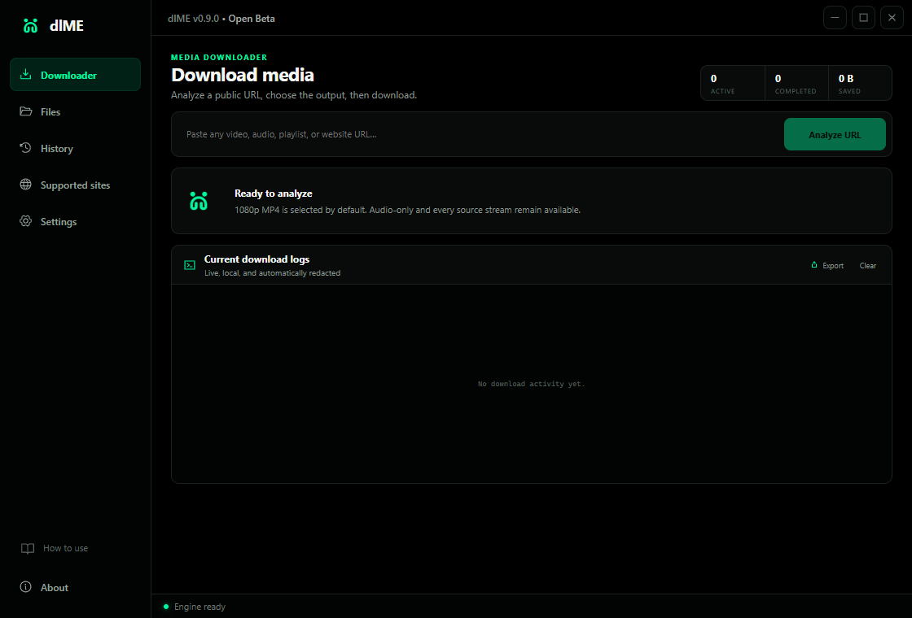
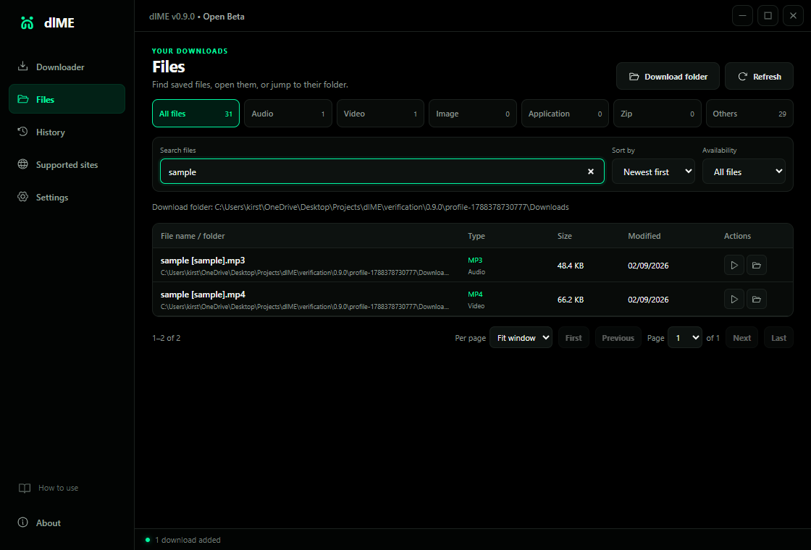
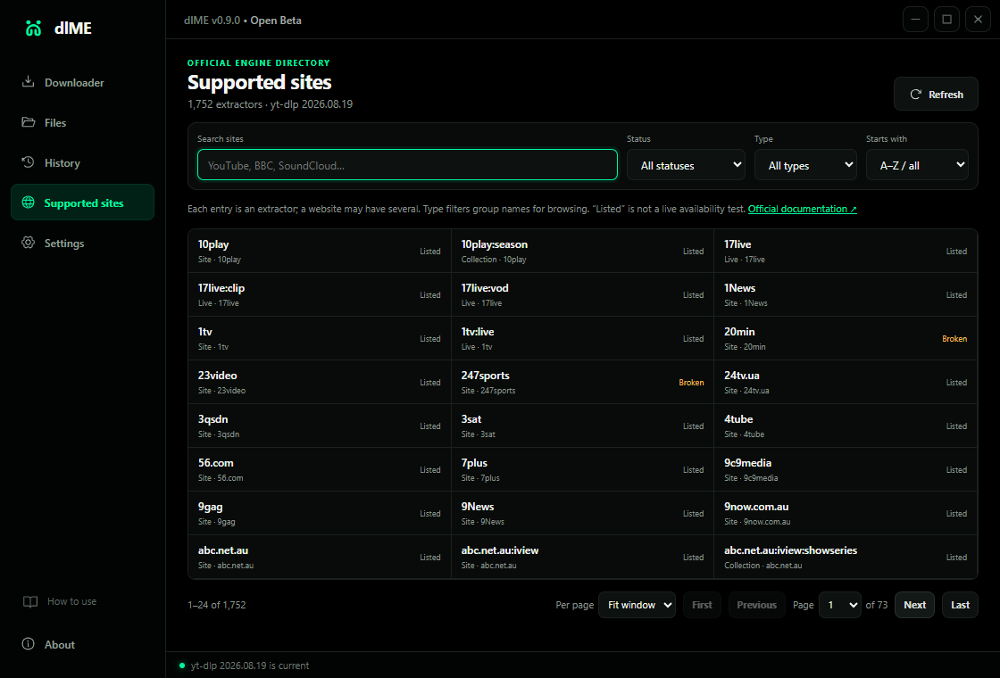

<p align="center">
  
</p>

<h1 align="center">dlME</h1>

<p align="center">
  A focused Windows media downloader with verified MP4 output, live engine feedback,<br>
  a searchable site directory, and a file library that stays on your computer.
</p>

<p align="center">
  <a href="https://github.com/YazeKT/dlME/actions/workflows/ci.yml"></a>
  <a href="https://github.com/YazeKT/dlME/releases"></a>
  <a href="LICENSE"></a>
  
</p>

<p align="center">
  <strong>Production-ready code, released as an open beta while public compatibility testing continues.</strong>
</p>

---



## Download

Get the Windows installer or portable build from **[GitHub Releases](https://github.com/YazeKT/dlME/releases)**.

| Build | Best for | Data location |
| --- | --- | --- |
| **Setup x64** | Normal Windows installation and shortcuts | Windows application-data folder |
| **Portable x64** | USB drives and self-contained use | `dlME-data` beside the executable |

dlME 0.9.0 is an unsigned Open Beta. Verify the downloaded file against `SHA256SUMS.txt`; Windows may display an unknown-publisher warning.

## Designed around the complete download workflow

| Download | Organize | Find |
| --- | --- | --- |
| Analyze a URL or playlist, choose video or audio, and follow real engine output. | New files are routed into Audio, Video, Image, Application, Zip, and Others. | Browse the filesystem with search, filters, sorting, availability, and pagination. |

- **Verified media:** video defaults to MP4 and FFprobe checks the final container and playable streams.
- **Truthful activity:** progress, speed, ETA, retries, and log messages come from the running job.
- **Safe recovery:** Stop & keep partial preserves supported transfer data for a later retry.
- **Independent Files browser:** clearing history does not hide media that still exists on disk.
- **Current extractor directory:** Supported reads the full list reported by the installed yt-dlp engine.
- **Optional browser sessions:** browser access stays off until a user enables it for account-required media.
- **Local-first data:** settings, history, logs, and imported legal documents remain on the computer.

<table>
  <tr>
    <td width="50%"></td>
    <td width="50%"></td>
  </tr>
  <tr>
    <td align="center"><strong>Browse downloaded files</strong></td>
    <td align="center"><strong>Search the installed engine directory</strong></td>
  </tr>
</table>

## What “supported” means

The Supported page comes from `yt-dlp --list-extractors`. It describes available extractor code; it does not promise that every URL will work. Websites can change independently, and login rules, regional limits, rate limits, anti-bot systems, removed media, and DRM still apply.

dlME does not bypass DRM, paywalls, access controls, or site challenges. Download only media you own or have permission to save.

## Build from source

### Requirements

- Windows 10 or Windows 11 x64
- Git
- Node.js 24 or a compatible current LTS release
- PowerShell

```powershell
git clone https://github.com/YazeKT/dlME.git
cd dlME
npm ci
npm run fetch:runtimes
npm run licenses
npm run verify
npm run dev
```

Create the Windows packages with:

```powershell
npm run package:win
```

Runtime downloads are release-pinned and SHA-256 verified. The renderer is sandboxed and does not receive unrestricted filesystem, process, or SQLite access.

## Project quality

- 28 automated behavior tests
- TypeScript strict mode
- Clean Windows CI build from `npm ci`
- Zero known npm audit findings at the 0.9.0 source tag
- Canonical-path checks for file open and reveal actions
- FFprobe validation before successful media completion
- Pinned runtime origins, versions, and hashes
- Release gate for third-party license materials

## Documentation

| Use dlME | Understand the project | Work on dlME |
| --- | --- | --- |
| [Installation](docs/INSTALLATION.md) | [Architecture](docs/ARCHITECTURE.md) | [Building](docs/BUILDING.md) |
| [User guide](docs/USER-GUIDE.md) | [Privacy](docs/PRIVACY.md) | [Contributing](CONTRIBUTING.md) |
| [Files and folders](docs/DOWNLOADS-AND-FILES.md) | [Legal and licensing](docs/LEGAL.md) | [Release process](docs/RELEASE-PROCESS.md) |
| [Troubleshooting](docs/TROUBLESHOOTING.md) | [Engine provenance](docs/ENGINE-PROVENANCE.md) | [Security policy](SECURITY.md) |
| [Supported sites](docs/SUPPORTED-SITES.md) | [Third-party notices](THIRD-PARTY-NOTICES.md) | [Roadmap](ROADMAP.md) |

## Privacy and licensing

dlME has no account system, advertisements, analytics, or telemetry. Network activity is limited to the media operation requested by the user and official engine update endpoints. Read the full [privacy document](docs/PRIVACY.md).

The dlME application source is published by **Yaze Media** under the [MIT License](LICENSE). Bundled or downloaded components retain their own terms. See [third-party notices](THIRD-PARTY-NOTICES.md) for yt-dlp, FFmpeg, FFprobe, Deno, Electron, Chromium, and application dependencies.

---

<p align="center">
  Created by <strong>Kirsten Trimaley</strong> · Published by <strong>Yaze Media</strong>
</p>
